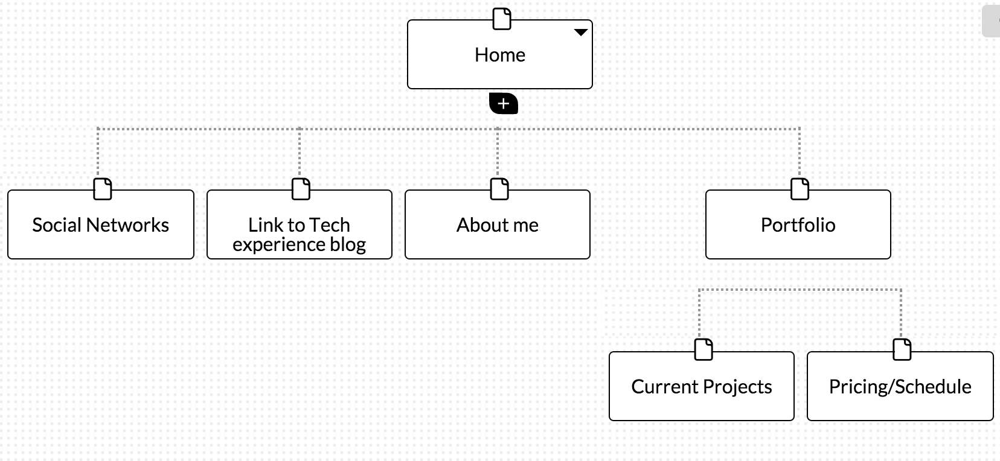

The Six Phases of Web Design (with most of the other questions answered in here):
1. Information Gathering
This is the most important part of creating your website. Here you identify your website's purpose, goals, target market, and content among other things. These things are important and interconnected. Determining the purpose will allow you to know what exactly you’re trying to do with the website(i.e. are you selling a product, advertising a service, etc.). After you know the purpose of the website you can determine the goal of the website (i.e. are you doing this for money, fun, to spread information, etc.). After you know your goals and your purpose the next logical thing to identify would be your target market. Your target market will really help you customize the website as once you have an understanding of who your target market it, you’ll develop a better understanding of how you would like to design the website to catch and keep their attention. Lastly, once you have an idea of what you would like to do with the website comes the content. The content is important because it is the meat of the website, the things on the website that make it unique, enjoyable, profitable, etc. The content would be a large part of the identity of the website.

My site’s purpose will be to advertise my (developing) free lance skills in tech while cross marketing my artistic abilities. My website will feature a lot of content I feel will be beneficial to targeting primarily artists who would like to have a professional website built. Thus my content would include not only a portfolio but also things ranging from my own art to a tech blog to make myself more personable to a diverse set of people.

2. Planning
In this phase you would like to create a website so that you can really understand the functionality of your website. Your site map is essentially what it is, it states all the locations you can go from your home page. That allows you to know not only how many sub categories you need to have for your website but also allows you to make sure that it’s clean so your website transitions well.

User Experience Design is essentially how people feel about the website they are using. The the main things you should know about it are better your website is planned out, the easier it is to use, the more people are likely  to continue visiting your website. This is valuable because the more people enjoy using and visiting your website they more likely they are to use it for it’s intended purpose.

here’s mine:

3. Design
This phase is really where you sit down and draw out exactly what you would like your website to look like. This is really where the information gathered previously on your target market really begins to come into play. Once you’ve decided who your target market is this is where you decide how you would like to draw them in. Whether you’d like big bright pictures if you’re making a website to appeal to children or if you’d like to have Paris Runways for a fashion oriented blog, this is where you explore that niche. Another important part about this part is creating prototypes so that your customer will have the ability to see what you’re working on. You’d like to have a clear line of communication and be open to critique from whomever you are working for/with. 

My target audience would primarily be brown men between the ages of 18 and 35 who would like a professional internet presence. I feel that my target audience would be interested in having a well done website by someone else who does art. I feel like my website would make my target market comfortable working with me because I feel we would have a great understanding of each other. Also my website will serve as a way to cross market my various abilities as well as getting a chance to further hone my coding skills.

The primary action I would like people to take when they go to my website would be to look at my portfolio. In my portfolio I will have websites that I’ve done for myself (that’s the best practice right?) complete with my information. Hopefully as I learn more at DBC I can add, transform, and grow my website so my portfolio will be a series of prototypes giving different options of what I can do. Also from there I’d hope to be able to link them to a personal website of things I do outside of coding.

4. Development
This is the portion of building your website where you create a fully functional website. Before now it’s primarily been a bunch of pictures so you can design the website and see what it looks like, this is where you make the website, well, a website. An important part of this is deciding which Content Management System, interactive contact forms,  commerce shopping carts, etc you’d like to use. 

5. Testing and Delivery
This is where you make sure that your website is operating at peek efficiency. You’d like to make sure that your website runs at all of the most up to date versions of internet browsing software. Also, this is where you’d work out any kinks with the code and installing any plug in installations as well as SEO (search engine optimization). In order to deliver it you’d need to put it on a FTP (File Transfer Protocol) which is a program used to upload website files to the server.

6. Maintenance
This  is the final portion of website creation. It’s where the purchaser of the website decides how they would like to go about maintaining their website. There’s several different options for them that will allow them to decide how involved they would like to be with the updates.

Also, this reflection was fun.  Nothing was tedious about it, as I actually had a small reference point with HTML before, but this planning section has given me a new idea of how to construct a website properly.

